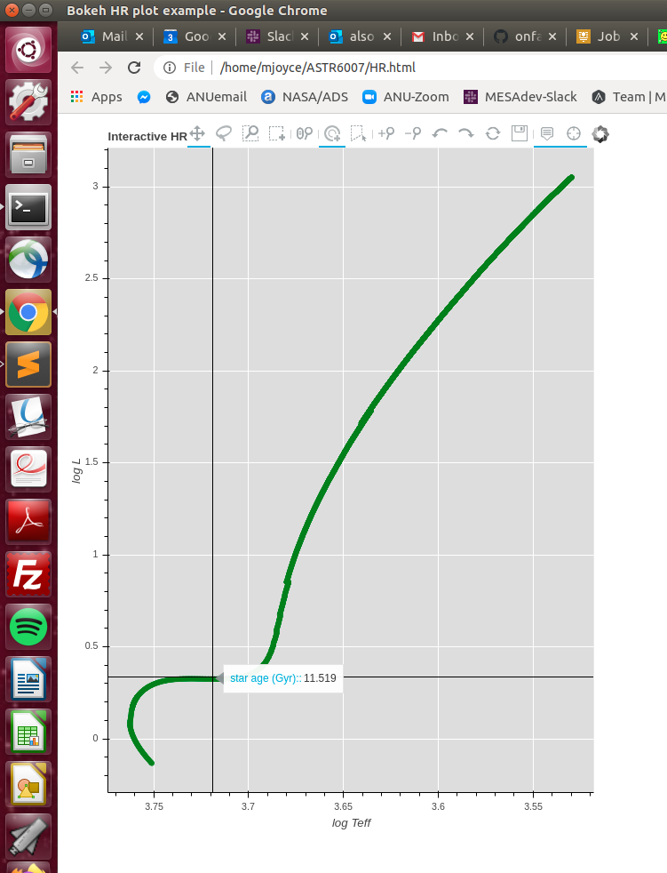

# ASTR3007_tools 
Using this repository is NOT a requirement of the course. However, answering questions like _How long does the main sequence last for a star of 2.0M?_ will become ***much easier*** if you are willing to invest a bit of time in learning clever ways to interact with MESA data.

## requires Python version 3.7

## Dependencies:
###### numpy
###### pandas
###### ColumnDataSource 

On newer systems, there are probably built-in ways to install Python3 packages that I do not know about or understand. Your Python application or interface will have some internal way of managing this.

To install all of these in the terminal, download or copy **requirements.txt** to your directory and type

	pip3 install -r requirements.txt --user

Or, equivalently, type out

	pip3 install -r numpy --user

for each package (numpy, pandas, ColumnDataSource) individually	

## Installation
If you already know how to use Python, or if you are friends with someone else who does, the easiest thing to do will be to copy the **Bokeh_students.py** script and use this in your preferred environment, keeping in mind that there are dependencies.

If you are new to Python, attempt to follow these instructions and email me furiously when they do not work.

## Use
Once you have Python3.7 and the other packages installed, type this in the terminal:

	python3 Bokeh_students.py

the result should be that an interactive HR diagram pops up in your web browser (see image below).

## Data inspection
One way to change the file you are viewing is to open the script

	Bokeh_students.py

in Sublime, gedit, Atom, Nano, or any other text editor and change the name of the file to be loaded in line 14:

	MESA_file = 'trimmed_history.data' --> MESA_file = 'folder_name/whatever_your_file_is_called'

Note that you can include folders in your path. Since you are downloading multiple tracks, make sure you do not accidentally overwrite any of the history data by putting files with the same name in the same location!

Note that lines 16-18 in the **Bokeh_students.py** tell the script which columns to read from **trimmed_history.data**. You may also change these manually to inspect other elements of the MESA evolutionary data. The quantity "star_age" is the default value that appears when you hover your curser in the browser. 

***This tool is intended only as a guide or starting point.*** If those of you with more advanced programming skills choose to modify this to help answer assignment questions more efficiently, please share your modifications with the rest of the class either here or via the Wattle forum.

## What should happen
A figure will open in your browser. You will be able to interact with this figure using tools in the upper panel. Hovering over a point on the track will give you its age in Gyr. Adding other useful "mouse-over" quantities, such as log_R, is possible by modifying **Bokeh_students.py**. If you would like to do this and are struggling, email me (but with evidence of having tried to figure it out yourself first).

 